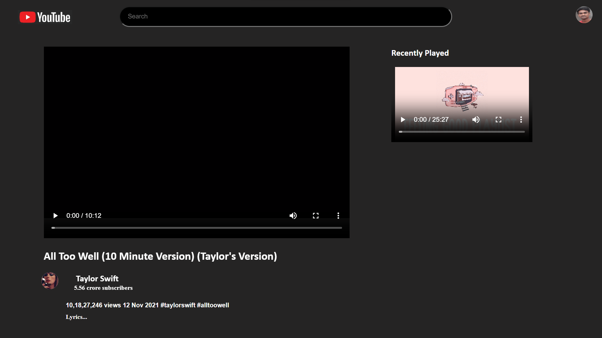

## Welcome to my YouTube page project!

This repository contains the code for a simple webpage that mimics the YouTube interface when playing a specific video. It's built with HTML and CSS, 
showcasing the basics of video embedding and layout.

## What's Included:

page.html: The main page file containing the video player and surrounding elements.
styles.css: Styles the page elements like header, video container, controls, etc.
video.mp4: A sample video file included for demonstration purposes.

## How it Works:

The page.html file embeds the video.mp4 using an <video> element.!
styles.css defines the layout and styles for the page elements, mimicking the YouTube interface.
The page displays a video thumbnail, play/pause button, progress bar, and volume control.

## THANK YOU :)
##
## 
